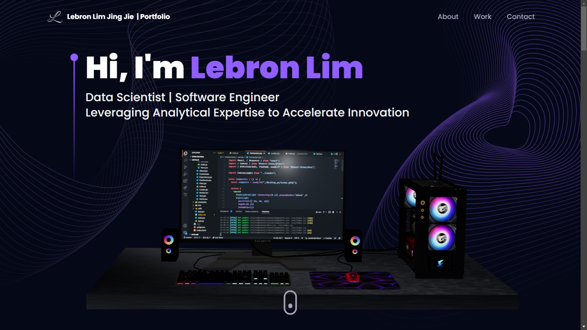

# Lebron Lim Portfolio Website

---

### Section 1: Introduction

Welcome to my portfolio website, where I've applied the valuable insights and skills gained from the JavaScript Mastery YouTube channel. As a dedicated learner and aspiring developer, I've meticulously crafted this space to showcase my journey and highlight the projects that reflect my evolving proficiency in Three.js and web development. Each project serves as a testament to my commitment to continuous learning and application of best practices.

My portfolio website can be found [here](https://lebronlim-portfolio.vercel.app/)

---

### Acknowledgements

Credits to **JavaScript Mastery** amazing youtube channel which I gained my inspiration from.  
JavaScript Mastery's youtube: [https://www.youtube.com/@javascriptmastery](https://www.youtube.com/@javascriptmastery)  
